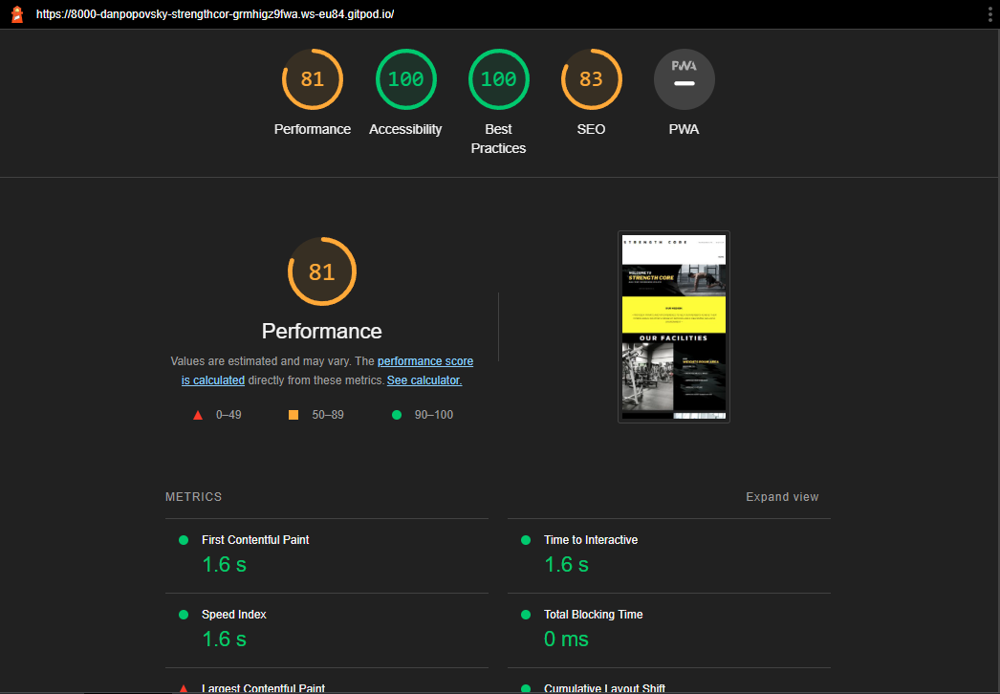
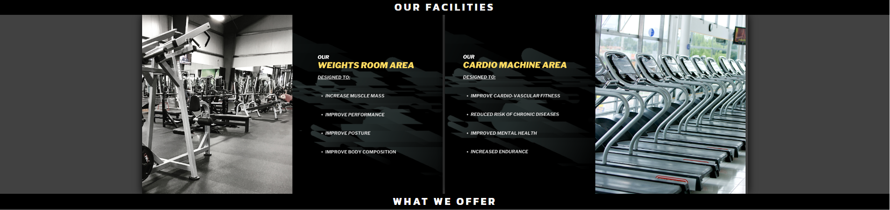

# Strength Core
(Developer: Daniel Popovsky)

[Live webpage](https://danpopovsky1997.github.io/strengthcore-project1/index.html)

## Table of Contents

1. [Project Goals](#project-goals)
  1. [User Goals](#user-goals)
  2. [Website Owner Goals](#website-owner-goals)
2. [User Experience](#user-experience)
    1. [Target Audience](#target-audience)
    2. [User Requrements and Expectations](#user-requirements-and-expectations)
    3. [User Stories](#user-stories)
3. [Design](#design)
    1. [Design Choices](#design-choices)
    2. [Colour](#colour)
    3. [Fonts](#fonts)
    4. [Structure](#structure)
    5. [Wireframes](#wireframes)
4. [Technologies Used](#technologies-used)
    1. [Languages](#languages)
    2. [Frameworks and Tools](#frameworks-and-tools)
5. [Features](#features)
6. [Testing](#validation)
    1. [HTML Validation](#HTML-validation)
    2. [CSS Validation](#CSS-validation)
    3. [Accessibility](#accessibility)
    4. [Performance](#performance)
    5. [Device testing](#performing-tests-on-various-devices)
    6. [Browser compatibility](#browser-compatability)
    7. [Testing user stories](#testing-user-stories)
8. [Bugs](#Bugs)
9. [Deployment](#deployment)
10. [Credits](#credits)
11. [Acknowledgements](#acknowledgements)

## Project Goals 

### User Goals
- Find a quality gym that provides state-of-the-art facilities
- Check pricing for memberships for the facilty
- Learn about the mission of the facility
- Be able to navigate through each page with ease
- An easy to follow sign up process
- Access to social media accounts if necessary

### Website Owner Goals
- Be able to attract a target audience
- Increase traction and generate leads
- An easy sign up process based on clients needs
- Be able to get our mission across

## User Experience 

### Target Audience
The website is designed with the following target audience in mind:
- Gym goers who want to join a membership gym
- People who are first timers who want to develop an understanding of exercise 
- People who want a group gym experience
- People who want a one-to-one coaching experience 
- People who want to be part of a community

### User Requirements and Expectations
- Simple user interface
- A navigation system that is easy to use
- Easy to navigate relevant information 
- All social links included for customer needs
- An appealing yet simplistic design
- Navigation menu works and directs customer to relevant pages

### User Stories

#### First Time User
1. As a first time user, I want to undestand what the gym provides
2. As a first time user, I want to know about the gym's mission
3. As a first time user, I want to know what the gym offers 
4. As a first time user, I want to see infomation about the different kinds of membership the gym offers
5. As a first time user, I want to be able to navigate to the sign up page easily
6. As a first time user, I want to access the gym's social media accounts

#### Returning User 
7. As a returning user, I want to be able to communicate with the gym via social links 
8. As a returning user, I want to be able to look at more products 
9. As a returning user, I want to see more updates made to the website in terms of accessibility and information

#### Site Owner
10. As a site owner, I want to get our mission across
11. As a site owner, I want the customer to find sign up page with ease
12. As a site owner, I want the website to be visually appealing to the customer
13. As a site owner, I want the function of the website to be clear

## Design

### Design Choices
The website was designed to make it look modern, simplistic, easy to use and accessible.

### Colour
I wanted to keep the color scheme simple and modern, with a touch of yellow as I feel this would make the website more appealing to the eye.

### Fonts
The font I decided to use was "Kanit", with sans serif as the backup font. I feel this font gave off a modern vibe that I was looking for.

### Structure
To keep the website experience simple and easy to navigate I decided to go with a navigation bar that displays the set menus: 
- Home page: Shows images of the facilities and advertises memberships
- Memberships page: Gives details about the memberships that are on offer with a link to the sign up page
- Sign up page: Allows the user to fill out a form with the preferred membership type

### Wireframes

Home Page

  

Membership Page

  

Sign Up Page

  

Tablet View

  

Mobile View

  

## Technologies Used

### Languages
To design and build my website I used the following:
- HTML
- CSS

### Frameworks and Tools
- Git
- Github
- Gitpod
- Google Fonts
- Balsamiq
- Canva

## Features 
The website contains 3 pages: the homepage, membership page, sign up page and a total of 20 features.

### Header (includes logo on the left and navigation on the right)
- The nav bar shows on every page
- The nav bar includes a logo
- The nav bar includes 3 menu options
- The current page is highlighted 'bold' (Unless on smallest screen)

Header

  

### Footer
- The footer shows on every page
- The footer includes links to social media accounts
- The footer also has a copyright statement for a professional look

Footer

  

### Facilities
- The facilities are shown on the homepage
- A description of the facilities is provided
- They are also responsive to media screen sizes

Facilities

  

### Membership Options
- Options are advertised on the homepage
- By clicking the button on the homepage, it redirects to the membership page
- On the memberdship page it provides the customer with membership type details and offers
- By clicking the sign up button it redirects them to the sign up page

Memberships

  

### Sign Up Form
- The sign up form is located on the sign up page
- The user fills out their details and membership preference
- This form has a submit button 'Let's Get Fit!'
- This form is sent to an email

Sign Up Form

  

### Hero Image
- A hero image is displayed on everypage
- Every page has a different hero image
- This hero image indicates what the current page is about

Hero Image: Home Page

  

Hero Image: Membership Page

  

Hero Image: Sign Up Page

  

## Validation

### HTML Validation
To validate my HTML I used The Nu HTML Checker (W3C). This tool ensures any errors, warnings or mistakes are detected before release. I ran this on all of my pages and only a few issues were found in terms of headings and IDs. None that had any impacts on the overall result of the web page, although for future reference, I will take any issues found into consideration to ensure no errors are found.

Homepage Validation

  

Membership Page Validation

  

Sign Up Page Validation

  

### CSS Validation
To validate my CSS I used The W3C Jigsaw CSS Validation Service. This ensures any warnings or errors are found. I ran the validation service for my web page and it passed without any errors.

CSS Validation for Web Page

  

### Accessibility 
I used the WAVE Web Evaluation tool by WebAIM to make sure my webpages met accessibility standards. All pages successfully passed.

Home Page Accessibility

  

Membership Page Accessibility

  

Sign Up Page Accessibility

  

### Performance
To measure performance I used Google's Lighthouse tool in Chrome Developer Tools. This was to ensure all pages met a high standard of performance accross different devices. Tests showed a high score on two devices, desktop and mobile

Lighthouse - Desktop

  

Lighthouse - Mobile

  

### Performance tests on various devices
Throughout the development of this webpage, I tested it's responsivness on various devices to ensure it functioned as intended. 
- iPhone 12 Pro Max
- iPhone 5
- iPad Air
- MacBook Pro laptop
- Desktop PC with a 24" monitor

### Browser Compatibility
I tested the website on the following web browsers to ensure consistency and responisvness:
- Google Chrome
- Edge
- Opera
- Mozilla Firefox

### Testing User Stories
1. As a first time user, I want to undestand what the gym provides

| **Feature** | **Action** | **Expected Result** | **Actual Result** |
|-------------|------------|---------------------|-------------------|
| Facilities | Navigate to the Home page and find the facilities images | See the facilites | Works as expected |
| Memberships | Navigate to the Memberships page and find the memberships | See the memberships | Works as expected |

Facilities - See the facilities on the home page

  

Memberships - See the memberships on the membership page

  

2. As a first time user, I want to know about the gym's mission

| **Feature** | **Action** | **Expected Result** | **Actual Result** |
|-------------|------------|---------------------|-------------------|
| Mission Statement | Navigate to the Home page and find the mission statement | See the mission | Works as expected |

Mission Statement - Can be seen on the homepage

  

3. As a first time user, I want to know what the gym offers 

| **Feature** | **Action** | **Expected Result** | **Actual Result** |
|-------------|------------|---------------------|-------------------|
| Facilities | Navigate to the Home page and find the facilities images | See the facilites | Works as expected |
| Memberships | Navigate to the Memberships page and find the memberships | See the memberships | Works as expected |

Facilities - See the facilities on the home page

  

Memberships - See the memberships on the membership page

  

4. As a first time user, I want to see infomation about the different kinds of membership the gym offers

| **Feature** | **Action** | **Expected Result** | **Actual Result** |
|-------------|------------|---------------------|-------------------|
| Memberships | Navigate to the Memberships page and find the memberships | See the memberships | Works as expected |

Memberships - Navigate the memberships

  

5. As a first time user, I want to be able to navigate to the sign up page easily

| **Feature** | **Action** | **Expected Result** | **Actual Result** |
|-------------|------------|---------------------|-------------------|
| Sign Up Form | Navigate to the Sign Up page and find the sign up form | Fill out the form | Works as expected |

Sign Up Form - Naviagte the sign up form

  

6. As a first time user, I want to access the gym's social media accounts

| **Feature** | **Action** | **Expected Result** | **Actual Result** |
|-------------|------------|---------------------|-------------------|
| Social Media Accounts | Navigate to the footer of any page and find the social media icons | Click the icons | Works as expected |

Social Media - Navigate the social media accounts

  

7. As a returning user, I want to be able to communicate with the gym via social links 

| **Feature** | **Action** | **Expected Result** | **Actual Result** |
|-------------|------------|---------------------|-------------------|
| Social Media Accounts | Navigate to the footer of any page and find the social media icons | Click the icons | Works as expected |

Social Media - Navigate the social media accounts

  

8. As a returning user, I want to be able to look at more products 

| **Feature** | **Action** | **Expected Result** | **Actual Result** |
|-------------|------------|---------------------|-------------------|
| Memberships | Navigate to the membership page | View products available | Works as expected |

Memberships - Navigate to the Memberships for future new products

  

9. As a returning user, I want to see more updates made to the website in terms of accessibility and information

| **Feature** | **Action** | **Expected Result** | **Actual Result** |
|-------------|------------|---------------------|-------------------|
| All Pages | Add more information and products overtime | View when updates are made | Works as expected |

Home page - New updates will be displayed on the home page

  

10. As a site owner, I want to get our mission across

| **Feature** | **Action** | **Expected Result** | **Actual Result** |
|-------------|------------|---------------------|-------------------|
| Home page | Navigate to the homepage | View our mission | Works as expected |

Mission Statement - Can be seen below the hero image

  

11. As a site owner, I want the customer to find the sign up page with ease

| **Feature** | **Action** | **Expected Result** | **Actual Result** |
|-------------|------------|---------------------|-------------------|
| Sign up form | Navigate to the sign up page | Fill out relevant information | Works as expected |

Sign Up Form - Fill out the sign up form

  

12. As a site owner, I want the website to be visually appealing to the customer

| **Feature** | **Action** | **Expected Result** | **Actual Result** |
|-------------|------------|---------------------|-------------------|
| Layout of the website | Make continious updates to webpage overtime | Customer sees visually appealing webpage | Works as expected |

Visual Updates - Will be seen on the home page below

  

13. As a site owner, I want the function of the website to be clear

| **Feature** | **Action** | **Expected Result** | **Actual Result** |
|-------------|------------|---------------------|-------------------|
| Memberships and Sign Up | Navigate to the memberships page or sign up page | View details about memberships and use sign up form to submit interest | Works as expected |

Two Main Functions - Membership offers and sign up page

  

## Bugs

| **Bug** | **Fix** |
|---------|---------|
| Nav bar would push over hero image when it was fixed | Removed the fixed value and it fixed the issue |
| Facilities image would be too wide when shrinking the screen size | Made images display in a column form when screen size was smaller |
| Membership images would be too wide when shrinking the screen size | Made images display in a column form when screen size was smaller |
| On small mobile screens nav bar was out of place when hovering because of the 'bold value' | Removed the bold value on the nav bar for smaller screen sizes |
| Social links too big for smaller screens | Ensured size of links was smaller depending on screen size |
| Sign up form too big for smaller screens | Ensured size of form and font size was smaller was smaller depending on screen size |

## Deployment

The webpage is deployed using GitHub Pages and can be carried out by performing the following steps:
1. In the repository, navigate to the settings
2. from the menu on the left hand side of the screen click on "Pages"
3. Ensure that you set the "source" to "Deploy from branch"
4. Select your desired "Branch" from the drop down menu
5. Click "Save" and following the page refresh, you should be provided with a URL link of the published site

If you would like to fork my repository, make sure that you follow the steps provided:
1. Go to the repository you wish to fork
2. Click on the "Fork" button in the right corner at the top
3. Select the desired owner and repository name. You may add a description of choice
4. Ensure that you copy to a default branch or all branches
5. Click "Create Form"

If you wish to clone a repository, follow the steps below:
1. Go the the repository you wish to clone
2. Click the "Code" button above the files
3. Select the method you wish to use when cloning, which would ethier be HTTPS, SSH or GitHub CLI
4. Open Git Bash
5. Chanage the current directory to the location you wish to have the cloned directory
6. Proceed to type "git clone", and then ensure that the URL you copied is pasted. It should look like the following with your GitHub username instead of the "YOUR-USERNAME": "$ git clone https://github.com/YOUR-USERNAME/DESIRED-REPOSITORY"
7. When you press enter, the local clone will be created successfully

## Credits

### Media

#### Images

- cardio-pic.png created myself using Canva at www.canva.com
- cover-image.png created myself using Canva www.canva.com
- memberships-page.png created myself using Canva www.canva.com
- one-month.png created myself using Canva www.canva.com
- sign-up-page.png created myself using Canva www.canva.com
- sign-up.png found through Google Images www.google.com/images
- six-month.png created myself using Canva www.canva.com
- three-month.png created myself using Canva www.canva.com
- weights-room.png created myself using Canva www.canva.com

### Code

HTML: "i" tags with icons for the social media icons were imported from FontAwesome

CSS: The font "Kanit" was imported via Google Fonts

README: Readme example (by Jarrad Baker, Skate Shack PP1) provided in Slack channel by tutor

## Acknowledgements 

I would like to thank the following people in supporting my journey to become a developer: 
- My partner Sarah, who constantly motivates me to never give up no matter what
- My parents, who encourage me to do something I love
- My work boss, who constantly supports me by allowing me to balance work and education
- My mentor Jack Wachira, who has been there as a support during our calls and answers any questions I have
- My slack team, who are on the same path to success as me and are always there to help

