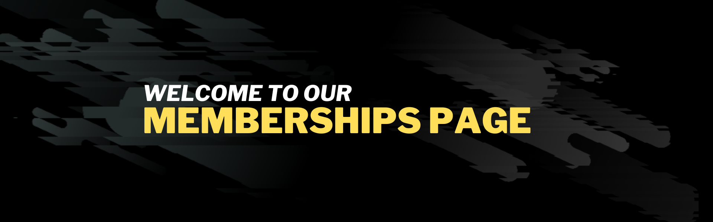

# Strength Core
(Developer: Daniel Popovsky)

[Live webpage](https://danpopovsky1997.github.io/strengthcore-project1/index.html)

## Table of Contents

1. [Project Goals](#project-goals)
  1. [User Goals](#user-goals)
  2. [Website Owner Goals](#website-owner-goals)
2. [User Experience](#user-experience)
    1. [Target Audience](#target-audience)
    2. [User Requrements and Expectations](#user-requirements-and-expectations)
    3. [User Stories](#user-stories)
3. [Design](#design)
    1. [Design Choices](#design-choices)
    2. [Colour](#colour)
    3. [Fonts](#fonts)
    4. [Structure](#structure)
    5. [Wireframes](#wireframes)
4. [Technologies Used](#technologies-used)
    1. [Languages](#languages)
    2. [Frameworks and Tools](#frameworks-and-tools)
5. [Features](#features)
6. [Testing](#validation)
    1. [HTML Validation](#HTML-validation)
    2. [CSS Validation](#CSS-validation)
    3. [Accessibility](#accessibility)
    4. [Performance](#performance)
    5. [Device testing](#performing-tests-on-various-devices)
    6. [Browser compatibility](#browser-compatability)
    7. [Testing user stories](#testing-user-stories)
8. [Bugs](#Bugs)
9. [Deployment](#deployment)
10. [Credits](#credits)
11. [Acknowledgements](#acknowledgements)

## Project Goals 

### User Goals
- Find a quality gym that provides state of the art facilities
- See pricing for memberships for the facilty
- Learn about the mission of the facility
- Be able to navigate through each page with ease
- An easy to follow sign up process
- Access to social media accounts if necessary

### Website owner goals
- Be able to attract a target audience
- Increase traction and generate leads
- An easy sign up process based on clients needs
- Be able to get our mission across

## User Experience 

### Target Audience
The website is designed with the following target audience in mind:
- Gym goers who want to join a membership gym
- People who are first timers who want to develop an understanding of exercise 
- People who want a group gym experience
- Pople who want a one to one coaching experience 
- People who want to be part of a community

### User Requirements and Expectations
- Simple user interface
- A navigation system that is easy to use
- Easy to navigate relevant information 
- All social links included for customer needs
- An appealing yet simplistic design
- Navigation menu works and directs customer to relevent pages

### User Stories

#### First Time User
1. As a first time user, I want to undestand what the gym provides
2. As a first time user, I want to know about the gym's mission
3. As a first time user, I want to know what the gym offers 
4. As a first time user, I want to see infomation about the different kinds of membership the gym offers
5. As a first time user, I want to be able to navigate to the sign up page easily
6. As a first time user, I want to access the gym's social media accounts

#### Returning User 
7. As a returning user, I want to be able to communicate to with the gym via social links 
As a returning user,
8. As a returning user, I want to be able to look at more products 
9. As a returning user, I want to see more updates made to the website in terms of accessibility and information

#### Site Owner
10. As a site owner, I want to get our mission across
11. As a site owner, I want the customer to find sign up with ease
12. As a site owner, I want the website to be visually appealing to the customer
13. As a site owner, I want the function of the website to be clear

## Design

### Design Choices
The website was designed to make it look modern, simplistic, easy to use and accessible.

### Colour
I wanted to keep the color scheme simple and modern, with a touch of yellow as I feel this would make the webisite more appealing to the eye.

### Fonts
The font I choice to use was "Kanit", with sans serif as the backup font. I feel this font gave off the modern vibe I was looking for.

### Structure
To keep the website experience simple and easy to navigate I decided to go with navigation bar that displays the set menus: 
- Home page: Shows images of the facilities and advertises memberships
- Memberships page: Gives details about the memberships that are on offer with a link to the sign up page
- Sign up page: Allows the user to fill out a form with the preferred membership type

### Wireframes

Home Page

  

Membership Page

  

Sign Up Page

  

Tablet View

  

Mobile View

  

## Technologies Used

### Languages
To design and build my website I used the following:
- HTML
- CSS

### Frameworks and Tools
- Git
- Github
- Gitpod
- Google Fonts
- Balsamiq
- Canva

## Features 
The website contains 3 pages the homepage, membership page, sign up page, 404 page and a total of 20 features.

### Header (includes logo on the left and navigation on the right)
- The nav bar shows every page
- The nav bar includes a logo
- The nav bar includes 3 menu options
- The current page is highlighted 'bold'

Header

  

### Footer
- The footer shows on every page
- The footer includes links to social media accounts
- The footer also has copyright text

Footer

  

### Facilities
- The facilities are shown on the homepage
- A description of the facilities is provided
- They are also responsive to media screen sizes

Facilities

  

### Membership Options
- Options are advertised on the homepage
- By clicking the button on the homepage it redirects to the membership page
- On the memberdship page it provides or relvant membership details
- By clicking the sign up button it redirects them to the sign up page

Memberships

  

### Sign Up Form
- The sign up form is located on the sign up page
- The user fills out their details and membership preference
- This form has a submit button 'Let's Get Fit!'
- This form is sent to an email

Sign Up Form

  

### Hero Image
- A hero image is displayed on everypage
- Every page has a different hero image
- This hero image indicates what the current page is about

Hero Image Home Page

  

Hero Image Membership Page

  

Hero Image Sign Up Page

  

## Validation

### HTML Validation

